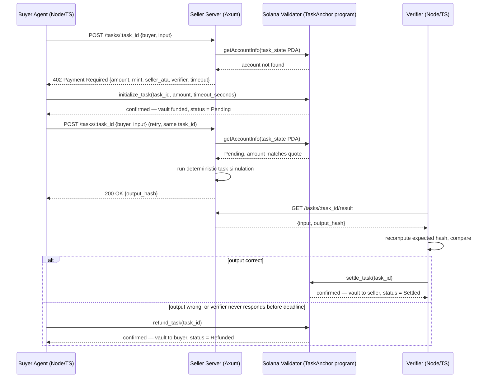

taskanchor archicte# TaskAnchor — MVP Architecture & Team Build Plan

A Solana-based crypto payment system with on-chain escrow and deterministic, independent verification. Local simulation only — no mainnet or devnet deployment. Built for a 3-developer hackathon team.

**Stack:** Solana (Anchor 1.x / Agave), Rust (Axum), Node.js/TypeScript (`@coral-xyz/anchor`), Docker.

> **A note on timeline before you start:** the concept brief lists this as both a "4 week hackathon" and, later, a "3-day hackathon." Those aren't compatible, and there's no way to guess which is right, so this plan is organized into four **dependency-driven phases** instead of fixed calendar days. Phase 1 must finish before Phases 2–3 can really start; Phase 4 is polish. Map the phases onto whatever your actual clock is — see the timeline table in Section 6.

---

## 1. Architecture Overview

### 1.1 The three components

| Component | Owns | Language |
|---|---|---|
| **On-chain program** | Escrow logic: lock funds, settle, refund | Rust / Anchor |
| **Seller server** | HTTP 402 flow, on-chain state verification, task execution | Rust / Axum |
| **Buyer agent + Verifier** | Payment construction, deterministic output checking, settlement trigger | Node.js / TypeScript |

The design borrows the shape of the emerging **x402** standard (HTTP 402 as a machine-readable payment challenge, client resubmits after paying) but extends it in one important way: vanilla x402 is a single-shot "pay, then get the resource" exchange with no escrow and no independent quality check. TaskAnchor adds an **escrow + independent verifier** step, because a seller's self-reported output can't be trusted — the buyer needs someone other than the seller to confirm the work was done correctly before the seller gets paid. That's the whole reason `settle_task` and `refund_task` exist as separate, conditional instructions instead of one atomic "pay-and-deliver" step.

### 1.2 Critical flow

```
┌──────────────┐   1. POST /tasks/:task_id        ┌───────────────────┐
│              │ ────────────────────────────────▶│                   │
│ Buyer Agent  │                                   │  Seller Server    │
│ (Node/TS)    │◀──────────────────────────────────│  (Rust / Axum)    │
│              │   2. 402 Payment Required + quote │                   │
└──────┬───────┘                                   └─────────┬─────────┘
       │                                                      │
       │ 3. initialize_task(task_id, amount, timeout)         │ 4. re-derive task_state PDA,
       │    signed by buyer — funds move buyer → vault PDA    │    read it fresh from chain
       ▼                                                      ▼
┌───────────────────────────────────────────────────────────────────────┐
│                  Solana Local Validator (Docker)                       │
│                  TaskAnchor Anchor Program                             │
│   • task_state PDA — buyer, seller, verifier, amount, deadline, status │
│   • vault PDA — SPL token account, authority = task_state PDA          │
└──────────────────────────────────┬──────────────────────────────────┬─┘
                                    │ 6a. settle_task                  │ 6b. refund_task
                                    │  (verifier signs, on success)    │  (buyer signs, after timeout)
                                    ▼                                  ▼
                          ┌───────────────────┐              back to Buyer Agent
                          │ Verifier (Node/TS) │
                          └─────────▲──────────┘
                                    │ 5. GET result, recompute
                                    │    expected output, compare
                                    └──── polls Seller Server
```

Sequence diagram version (renders automatically on GitHub; shows as a labeled code block in the PDF):



Two things worth calling out about this flow, because they're the source of most bugs teams hit with this pattern:

- **The HTTP layer needs no auth of its own.** Anyone can `POST /tasks/:task_id` claiming to be any buyer — it doesn't matter, because the server only proceeds once it independently confirms real funds are locked in a PDA that only a genuine `initialize_task` transaction could have created. HTTP-layer identity claims are advisory; on-chain state is the only thing that's authoritative. This is also why the seller server never needs a private key: it only ever *reads* chain state, it never signs a transaction.
- **`task_id` is chosen by the buyer, not the server.** The buyer agent picks a random `u64` locally before making any request. This avoids a chicken-and-egg problem: if the server handed out `task_id`s, the very first request couldn't derive a PDA (which needs `task_id` as a seed) without a round trip just to get one. Client-generated IDs mean the buyer can compute its own `task_state`/`vault` PDA addresses before it ever talks to the server.

---

## 2. Team Breakdown (3 Roles)

| | **Role A — Chain Engineer** | **Role B — Seller Server Engineer** | **Role C — Agent & Verifier Engineer** |
|---|---|---|---|
| **Owns** | Anchor program, local validator + Docker, SPL token + keypair setup | Axum HTTP server, 402 middleware, on-chain state checks, task simulation | Buyer agent script, deterministic verifier script |
| **Language** | Rust (Anchor) | Rust (Axum) | Node.js / TypeScript |
| **Depends on** | Nothing — this is the foundation | Role A's IDL + program ID + PDA scheme | Role A's IDL + program ID; Role B's HTTP contract |
| **Delivers** | Deployed-to-local-validator program, IDL, PDA derivation doc, keypairs, funded dummy-USDC accounts | Working `/tasks/:task_id` endpoint with 402 + execute flow | Script that completes a full pay → execute → verify → settle run end-to-end |

**Why this split and not another one:** the brief lists five pieces (validator, contract, seller server, buyer agent, verifier) across three people. Buyer agent and verifier are grouped together because they're both thin off-chain TypeScript scripts that share the same tooling — one `@coral-xyz/anchor` client setup, one wallet-loading helper, one RPC connection. Splitting them into two different roles would mean someone builds an Anchor TS client wrapper twice for no reason. It also keeps the two Rust-heavy roles (chain program, Axum server) together conceptually even though they're different people, since Role B directly imports Role A's program crate (details in Section 3).

**Dependency order:** Role A has to produce a *stable interface* before B and C can do real integration work — not a finished program, just: program ID, account layouts, and PDA seeds locked in. In practice:

1. **Day/session 1 (whichever unit your timeline uses):** Role A scaffolds the program — account structs, instruction signatures, PDA seeds — even with instruction bodies stubbed (`todo!()`/empty), and runs `anchor build` to generate a real IDL. Push this immediately so B and C aren't blocked.
2. **In parallel from session 1:** Role B builds the Axum skeleton and 402 response shape against the *stubbed* IDL. Role C builds the buyer agent's HTTP handling and Anchor client setup against the same stub, and can fully implement the deterministic hash function (it doesn't depend on the chain at all).
3. **Session 2:** Role A fills in real instruction logic. B and C swap their stubbed program calls for real ones as soon as each instruction lands — `initialize_task` unblocks C first, `settle_task` and `refund_task` unblock the rest.
4. **Session 3 onward:** integration (Section 5) and edge cases (Section 4).


---

## 3. Detailed Implementation

### 3.1 Role A — Chain Engineer

#### Setup

```bash
# Rust
curl --proto '=https' --tlsv1.2 -sSf https://sh.rustup.rs | sh -s -- -y
. "$HOME/.cargo/env"

# Solana CLI (Agave — the validator client maintained by Anza, formerly "Solana Labs validator")
sh -c "$(curl -sSfL https://release.anza.xyz/stable/install)"
export PATH="$HOME/.local/share/solana/install/active_release/bin:$PATH"
solana --version

# Anchor via AVM (Anchor Version Manager)
cargo install --git https://github.com/otter-sec/anchor avm --force
avm install latest
avm use latest
anchor --version   # expect anchor-cli 1.x
```

Scaffold the program:

```bash
anchor init task-anchor
cd task-anchor
```

`anchor init` now defaults to a **modular Rust layout** with LiteSVM-based Rust tests (not TypeScript/mocha — that changed a few versions back). This works in our favor: LiteSVM tests run in-process with no validator needed, so Role A's inner dev loop is fast. Lay the program out by domain, not as one giant `lib.rs`:

```
programs/task_anchor/src/
├── lib.rs              # program entrypoint, re-exports
├── constants.rs         # seeds, default timeout, etc.
├── errors.rs             # TaskAnchorError
├── state.rs               # TaskState, TaskStatus
└── instructions/
    ├── mod.rs
    ├── initialize_task.rs
    ├── settle_task.rs
    └── refund_task.rs
```

#### Local validator, keypairs, and the dummy-USDC mint

No special validator image exists to pull — build a minimal one that just installs the Solana CLI and runs `solana-test-validator` as its command:

```dockerfile
# Dockerfile.validator
FROM ubuntu:22.04
RUN apt-get update && apt-get install -y curl build-essential pkg-config libssl-dev ca-certificates
RUN sh -c "$(curl -sSfL https://release.anza.xyz/stable/install)"
ENV PATH="/root/.local/share/solana/install/active_release/bin:${PATH}"
EXPOSE 8899 8900
CMD ["solana-test-validator", "--reset", "--quiet"]
```

```yaml
# docker-compose.yml
services:
  validator:
    build:
      context: .
      dockerfile: Dockerfile.validator
    ports:
      - "8899:8899"   # RPC
      - "8900:8900"   # WebSocket — needed for account-change subscriptions
    volumes:
      - validator-ledger:/root/.local/share/solana/install
volumes:
  validator-ledger:
```

```bash
docker compose up -d validator
solana config set --url http://localhost:8899
```

Three keypairs, funded via the local validator's unlimited airdrop (this only works locally — devnet caps airdrops at 5 SOL per request, mainnet has none at all):

```bash
mkdir -p keys
solana-keygen new --outfile keys/buyer.json    --no-bip39-passphrase
solana-keygen new --outfile keys/seller.json   --no-bip39-passphrase
solana-keygen new --outfile keys/verifier.json --no-bip39-passphrase

for role in buyer seller verifier; do
  solana airdrop 10 "$(solana-keygen pubkey keys/$role.json)"
done
```

Dummy USDC as a real SPL mint, 6 decimals to match real USDC's convention (so nobody downstream needs a special case for a different decimal count):

```bash
spl-token create-token --decimals 6              # prints the mint address — save it
export MINT=<mint address from above>

spl-token create-account "$MINT" --owner keys/buyer.json
spl-token create-account "$MINT" --owner keys/seller.json

# Mint 1000 dummy-USDC to the buyer for testing (mint authority defaults to your CLI wallet)
spl-token mint "$MINT" 1000 "$(spl-token address --owner keys/buyer.json --token "$MINT")"
```

Once `anchor keys sync` has set the real program ID, put it, the mint address, and all three public keys in a `deployment.json` at the repo root — that's the one file B and C actually need to read to point their code at the right addresses. **Never commit the keypair files themselves.** `keys/` goes in `.gitignore` from the first commit — these happen to be throwaway local-validator keys with no real value, but the habit is what matters.

#### PDA design

Two PDAs, both derived from data everyone already has — no PDA address is ever trusted from a client without being re-derived server-side:

```rust
// constants.rs
pub const TASK_SEED: &[u8] = b"task";
pub const VAULT_SEED: &[u8] = b"vault";
pub const DEFAULT_TIMEOUT_SECONDS: i64 = 180; // 3 minutes — MVP default, tunable per-instruction
```

- `task_state`: `[TASK_SEED, buyer.as_ref(), &task_id.to_le_bytes()]` — one task account per (buyer, task_id) pair, so a buyer can have several tasks in flight.
- `vault`: `[VAULT_SEED, task_state.key().as_ref()]` — an SPL token account whose **authority is the `task_state` PDA itself**, not a keypair. This is the core trick that makes the escrow trustless: no private key exists for a PDA, so the *only* way tokens leave the vault is by the on-chain program signing with those exact seeds inside `settle_task` or `refund_task`. There is no key anyone could leak or be coerced into using — the program's instruction logic *is* the authorization policy.

```rust
// state.rs
use anchor_lang::prelude::*;

#[account]
#[derive(InitSpace)]
pub struct TaskState {
    pub buyer: Pubkey,
    pub seller: Pubkey,
    pub verifier: Pubkey,
    pub mint: Pubkey,
    pub task_id: u64,
    pub amount: u64,
    pub deadline_unix: i64,
    pub status: TaskStatus,
    pub bump: u8,
}

#[derive(AnchorSerialize, AnchorDeserialize, InitSpace, Clone, Copy, PartialEq, Eq)]
pub enum TaskStatus {
    Pending,
    Settled,
    Refunded,
}
```

`TaskStatus` is an enum, not three booleans (`is_settled`, `is_refunded`, ...). With booleans, `is_settled = true, is_refunded = true` is representable but meaningless — the type system can't stop it, so you'd need a runtime check to catch a state a bug produced. With an enum, that combination cannot be constructed at all — the compiler only allows exactly one status at a time. Anchor's `#[derive(InitSpace)]` also removes manual byte-counting for account rent — it computes the account size from the struct definition (a fixed-size enum with only unit variants like this one costs 1 byte).

#### Instructions

```rust
// instructions/initialize_task.rs
use anchor_lang::prelude::*;
use anchor_spl::token::{Mint, Token, TokenAccount, Transfer, transfer};
use crate::{constants::*, state::*, errors::TaskAnchorError};

#[derive(Accounts)]
#[instruction(task_id: u64)]
pub struct InitializeTask<'info> {
    #[account(mut)]
    pub buyer: Signer<'info>,

    /// CHECK: only used as a pubkey reference stored in task_state; not read or written here
    pub seller: UncheckedAccount<'info>,
    /// CHECK: same — verifier identity is just a stored pubkey at this stage
    pub verifier: UncheckedAccount<'info>,

    pub mint: Account<'info, Mint>,

    #[account(
        init,
        payer = buyer,
        space = 8 + TaskState::INIT_SPACE,
        seeds = [TASK_SEED, buyer.key().as_ref(), &task_id.to_le_bytes()],
        bump,
    )]
    pub task_state: Account<'info, TaskState>,

    #[account(
        init,
        payer = buyer,
        seeds = [VAULT_SEED, task_state.key().as_ref()],
        bump,
        token::mint = mint,
        token::authority = task_state,
    )]
    pub vault: Account<'info, TokenAccount>,

    #[account(mut, constraint = buyer_token_account.mint == mint.key())]
    pub buyer_token_account: Account<'info, TokenAccount>,

    pub token_program: Program<'info, Token>,
    pub system_program: Program<'info, System>,
}

pub fn handler(
    ctx: Context<InitializeTask>,
    task_id: u64,
    amount: u64,
    timeout_seconds: i64,
) -> Result<()> {
    require!(amount > 0, TaskAnchorError::InvalidAmount);
    require!(timeout_seconds > 0, TaskAnchorError::InvalidTimeout);

    let task_state = &mut ctx.accounts.task_state;
    task_state.buyer = ctx.accounts.buyer.key();
    task_state.seller = ctx.accounts.seller.key();
    task_state.verifier = ctx.accounts.verifier.key();
    task_state.mint = ctx.accounts.mint.key();
    task_state.task_id = task_id;
    task_state.amount = amount;
    task_state.deadline_unix = Clock::get()?.unix_timestamp
        .checked_add(timeout_seconds)
        .ok_or(TaskAnchorError::Overflow)?;
    task_state.status = TaskStatus::Pending;
    task_state.bump = ctx.bumps.task_state;

    transfer(
        CpiContext::new(
            ctx.accounts.token_program.to_account_info(),
            Transfer {
                from: ctx.accounts.buyer_token_account.to_account_info(),
                to: ctx.accounts.vault.to_account_info(),
                authority: ctx.accounts.buyer.to_account_info(),
            },
        ),
        amount,
    )?;
    Ok(())
}
```

**Why this can't leave the vault half-funded:** Solana transactions are atomic — if the `transfer` CPI at the end fails for any reason (insufficient balance, wrong mint), the *entire* transaction rolls back, including the `init` of `task_state` and `vault`. There's no state where the accounts exist but the vault is empty, or vice versa. That's a guarantee from the runtime, not something this program has to implement itself.

```rust
// instructions/settle_task.rs
use anchor_lang::prelude::*;
use anchor_spl::token::{Token, TokenAccount, Transfer, transfer};
use crate::{constants::*, state::*, errors::TaskAnchorError};

#[derive(Accounts)]
pub struct SettleTask<'info> {
    #[account(
        mut,
        has_one = verifier @ TaskAnchorError::InvalidVerifier,
        seeds = [TASK_SEED, task_state.buyer.as_ref(), &task_state.task_id.to_le_bytes()],
        bump = task_state.bump,
    )]
    pub task_state: Account<'info, TaskState>,

    pub verifier: Signer<'info>,

    #[account(
        mut,
        seeds = [VAULT_SEED, task_state.key().as_ref()],
        bump,
    )]
    pub vault: Account<'info, TokenAccount>,

    #[account(mut, constraint = seller_token_account.owner == task_state.seller)]
    pub seller_token_account: Account<'info, TokenAccount>,

    pub token_program: Program<'info, Token>,
}

pub fn handler(ctx: Context<SettleTask>) -> Result<()> {
    let task_state = &mut ctx.accounts.task_state;
    require!(task_state.status == TaskStatus::Pending, TaskAnchorError::TaskNotPending);
    require!(Clock::get()?.unix_timestamp <= task_state.deadline_unix, TaskAnchorError::TaskExpired);

    let task_id_bytes = task_state.task_id.to_le_bytes();
    let seeds: &[&[u8]] = &[TASK_SEED, task_state.buyer.as_ref(), &task_id_bytes, &[task_state.bump]];

    transfer(
        CpiContext::new_with_signer(
            ctx.accounts.token_program.to_account_info(),
            Transfer {
                from: ctx.accounts.vault.to_account_info(),
                to: ctx.accounts.seller_token_account.to_account_info(),
                authority: task_state.to_account_info(),
            },
            &[seeds],
        ),
        task_state.amount,
    )?;

    task_state.status = TaskStatus::Settled;
    Ok(())
}
```

`refund_task` mirrors `settle_task` almost exactly — same PDA-signed transfer pattern — but flips the guard conditions and the destination:

```rust
// instructions/refund_task.rs (handler body — Accounts struct omitted, same shape as SettleTask
// but with `buyer: Signer` instead of `verifier`, has_one = buyer, and buyer_token_account destination)
pub fn handler(ctx: Context<RefundTask>) -> Result<()> {
    let task_state = &mut ctx.accounts.task_state;
    require!(task_state.status == TaskStatus::Pending, TaskAnchorError::TaskNotPending);
    require!(Clock::get()?.unix_timestamp > task_state.deadline_unix, TaskAnchorError::TaskNotExpired);

    // ... identical CPI transfer, vault -> buyer_token_account, same PDA signer seeds ...

    task_state.status = TaskStatus::Refunded;
    Ok(())
}
```

```rust
// errors.rs
use anchor_lang::prelude::*;

#[error_code]
pub enum TaskAnchorError {
    #[msg("Amount must be greater than zero")]
    InvalidAmount,
    #[msg("Timeout must be greater than zero")]
    InvalidTimeout,
    #[msg("Deadline calculation overflowed")]
    Overflow,
    #[msg("Task is not in Pending status")]
    TaskNotPending,
    #[msg("Task deadline has not passed yet")]
    TaskNotExpired,
    #[msg("Task deadline has already passed")]
    TaskExpired,
    #[msg("Signer is not the designated verifier for this task")]
    InvalidVerifier,
}
```

#### Security considerations (the parts worth being paranoid about even in an MVP)

- **`has_one = verifier`** on `settle_task` means only the exact pubkey stored in `task_state.verifier` at creation time can ever settle it. Without this, a malicious buyer could pass their own keypair as "verifier" at `initialize_task` time and instantly self-settle without any real check — the constraint is what makes the verifier's role meaningful at all.
- **`constraint = seller_token_account.owner == task_state.seller`** on `settle_task` stops a caller from redirecting the payout to an arbitrary token account they control. Fund destination is pinned to the seller pubkey recorded at task creation, not whatever account the transaction happens to name.
- **Checked arithmetic** (`checked_add` for the deadline) avoids silent wraparound. Rust panics on overflow in debug builds but wraps silently in release builds unless `overflow-checks = true` is set — for anything handling value transfer, use `checked_*` everywhere and don't rely on the build profile to catch it for you.
- **PDA seeds + `bump` constraints**, not client-supplied addresses, are what tie an account to a specific task. Anchor re-derives and checks the PDA on every instruction; a client can't substitute a different account at the same field name and have it pass.
- The vault's authority is a PDA with no private key — see the PDA design note above. This is the single biggest reason this design doesn't need a "seller trusted with funds" step anywhere.

#### Trade-off note: `unix_timestamp` vs. slots for the deadline

This plan uses `Clock::get()?.unix_timestamp` for the deadline because it's easy to reason about ("3 minutes from now"). Slot-based deadlines (`Clock::get()?.slot`) are the more common choice in production Solana programs because they're insulated from validator clock drift — `unix_timestamp` is a validator-reported estimate, not a hard guarantee. For a local single-validator MVP this doesn't matter; if this ever targets a real cluster, switch to slots.


### 3.2 Role B — Seller Server Engineer

#### Setup

```bash
cargo new seller-server
cd seller-server
cargo add axum tokio --features tokio/full
cargo add serde serde_json --features serde/derive
cargo add solana-client solana-sdk anchor-lang sha2 hex
```

**One shared-crate step before you start:** Role A's `TaskState`/`TaskStatus` structs live inside the `task_anchor` program crate (Section 3.1). Pulling that whole crate into an off-chain Axum binary as a plain dependency can run into entrypoint-linking friction depending on the exact Anchor version — rather than debug that mid-hackathon, ask Role A to do a 10-minute extraction: move `state.rs`'s contents (plus the two seed constants) into a tiny new crate with no `#[program]` macro at all —

```
shared/task-anchor-types/
├── Cargo.toml     # deps: anchor-lang only
└── src/lib.rs     # TaskState, TaskStatus, TASK_SEED, VAULT_SEED
```

— and have `programs/task_anchor/src/state.rs` become `pub use task_anchor_types::*;`. Nothing else in Role A's instruction code needs to change. Role B (and Role C's Rust-side tooling, if any) then depends on `task-anchor-types` directly:

```toml
# seller-server/Cargo.toml
[dependencies]
task-anchor-types = { path = "../shared/task-anchor-types" }
anchor-lang = "0.30"   # match whatever version Role A's Cargo.lock resolved — same major/minor
solana-client = "..."  # ditto — mismatched solana-sdk/anchor-lang versions produce confusing
solana-sdk = "..."     # "expected Pubkey, found Pubkey" errors from duplicate crate versions
```

#### The endpoint

One route does the whole 402 dance: `POST /tasks/:task_id`. Called once before payment (returns 402 + a quote) and once after (returns the task's output). No separate "pay" and "execute" endpoints, no payment-proof header to parse — the proof *is* the on-chain state, and the server checks that directly.

```rust
// main.rs
use axum::{extract::{Path, State}, http::StatusCode, routing::{get, post}, Json, Router};
use serde::{Deserialize, Serialize};
use solana_client::nonblocking::rpc_client::RpcClient;
use solana_sdk::pubkey::Pubkey;
use anchor_lang::AccountDeserialize;
use task_anchor_types::{TaskState, TaskStatus, TASK_SEED, VAULT_SEED};
use sha2::{Digest, Sha256};
use std::{collections::HashMap, str::FromStr, sync::{Arc, Mutex}};

#[derive(Clone)]
struct AppState {
    rpc: Arc<RpcClient>,
    program_id: Pubkey,
    mint: Pubkey,
    seller_token_account: Pubkey,
    verifier: Pubkey,
    price: u64,
    timeout_seconds: i64,
    // Keyed by task_id alone for this single-buyer demo. On-chain uniqueness is really
    // (buyer, task_id) — key by that pair too if more than one buyer runs concurrently.
    results: Arc<Mutex<HashMap<u64, TaskResult>>>,
}

#[derive(Clone, Serialize)]
struct TaskResult {
    input: serde_json::Value,
    output_hash: String,
}

#[derive(Deserialize)]
struct TaskRequest {
    buyer: String,
    input: serde_json::Value,
}

#[derive(Serialize)]
struct PaymentQuote {
    task_id: u64,
    program_id: String,
    task_state_pda: String,
    vault_pda: String,
    mint: String,
    seller_token_account: String,
    verifier: String,
    amount: u64,
    timeout_seconds: i64,
}

async fn handle_task(
    State(state): State<AppState>,
    Path(task_id): Path<u64>,
    Json(req): Json<TaskRequest>,
) -> Result<Json<TaskResult>, (StatusCode, Json<serde_json::Value>)> {
    let buyer = Pubkey::from_str(&req.buyer)
        .map_err(|_| (StatusCode::BAD_REQUEST, Json(serde_json::json!({"error": "invalid buyer pubkey"}))))?;

    let (task_state_pda, _) = Pubkey::find_program_address(
        &[TASK_SEED, buyer.as_ref(), &task_id.to_le_bytes()],
        &state.program_id,
    );

    let task_state = match state.rpc.get_account(&task_state_pda).await {
        Err(_) => return Err(payment_required(&state, task_id, &task_state_pda)),
        Ok(acc) => TaskState::try_deserialize(&mut acc.data.as_slice())
            .map_err(|_| (StatusCode::INTERNAL_SERVER_ERROR, Json(serde_json::json!({"error": "corrupt task account"}))))?,
    };

    if task_state.status != TaskStatus::Pending {
        return Err((StatusCode::CONFLICT, Json(serde_json::json!({
            "error": "task already settled or refunded", "status": format!("{:?}", task_state.status),
        }))));
    }
    if task_state.amount < state.price || task_state.mint != state.mint {
        return Err(payment_required(&state, task_id, &task_state_pda));
    }

    let output_hash = execute_task(&req.input);
    let result = TaskResult { input: req.input, output_hash };
    state.results.lock().unwrap().insert(task_id, result.clone());
    Ok(Json(result))
}

fn payment_required(state: &AppState, task_id: u64, task_state_pda: &Pubkey) -> (StatusCode, Json<serde_json::Value>) {
    let (vault_pda, _) = Pubkey::find_program_address(&[VAULT_SEED, task_state_pda.as_ref()], &state.program_id);
    let quote = PaymentQuote {
        task_id,
        program_id: state.program_id.to_string(),
        task_state_pda: task_state_pda.to_string(),
        vault_pda: vault_pda.to_string(),
        mint: state.mint.to_string(),
        seller_token_account: state.seller_token_account.to_string(),
        verifier: state.verifier.to_string(),
        amount: state.price,
        timeout_seconds: state.timeout_seconds,
    };
    (StatusCode::PAYMENT_REQUIRED, Json(serde_json::to_value(quote).unwrap()))
}

// MVP stand-in for real compute: hash a canonical form of the input. Swap this for
// actual work later; see the determinism note below before you do.
fn execute_task(input: &serde_json::Value) -> String {
    let canonical = serde_json::to_string(input).unwrap();
    let mut hasher = Sha256::new();
    hasher.update(canonical.as_bytes());
    hex::encode(hasher.finalize())
}

async fn get_result(
    State(state): State<AppState>,
    Path(task_id): Path<u64>,
) -> Result<Json<TaskResult>, StatusCode> {
    state.results.lock().unwrap().get(&task_id).cloned().map(Json).ok_or(StatusCode::NOT_FOUND)
}

#[tokio::main]
async fn main() {
    let state = AppState { /* populate from env vars — see Section 6 repo layout */ };
    let app = Router::new()
        .route("/tasks/:task_id", post(handle_task))
        .route("/tasks/:task_id/result", get(get_result))
        .with_state(state);
    let listener = tokio::net::TcpListener::bind("0.0.0.0:3000").await.unwrap();
    axum::serve(listener, app).await.unwrap();
}
```

**Why `execute_task`'s canonicalization works without a hand-written key-sorter:** `serde_json::Value`'s object type is a `BTreeMap` by default — it only switches to insertion-order (`IndexMap`) if the crate's `preserve_order` feature is enabled. So as long as nothing in the dependency tree turns that feature on, `serde_json::to_string(&value)` already emits object keys in sorted order for free. That sorted, compact JSON string is exactly the canonical form the TypeScript verifier needs to reproduce byte-for-byte (Section 3.3) for the hash to match. **Stick to integers, strings, and booleans in task `input` for the demo** — floating-point serialization can differ subtly between Rust's `serde_json` and JavaScript's `JSON.stringify` (trailing zeros, exponent thresholds), which would reintroduce exactly the cross-language nondeterminism this whole scheme exists to avoid.

**Why the server never holds a private key:** every instruction that moves funds (`settle_task`, `refund_task`) is signed by the verifier or the buyer, never the seller. The seller server only needs its **public** key and its token account address to receive payouts — there's no hot wallet to protect on this box at all, which is a meaningfully smaller attack surface for a service that's directly exposed to the internet in a real deployment.

### 3.3 Role C — Agent & Verifier Engineer

#### Setup

```bash
mkdir buyer-agent && cd buyer-agent
npm init -y
npm install @coral-xyz/anchor @solana/web3.js @solana/spl-token axios
npm install -D typescript ts-node @types/node
npx tsc --init
```

Double-check the package name before installing — `@coral-xyz/anchor` has been typosquatted before (a fake `@merceas/anchor` package copying its README was caught and delisted in 2026), so confirm the scope in `package.json` matches exactly.

#### Buyer agent

The agent generates its own `task_id` — no round trip to the server just to get one (see Section 1.2 for why). It can therefore derive both PDAs itself before making any HTTP call.

```typescript
// agent.ts
import * as anchor from "@coral-xyz/anchor";
import { PublicKey, Connection, Keypair } from "@solana/web3.js";
import { TOKEN_PROGRAM_ID } from "@solana/spl-token";
import axios from "axios";
import * as crypto from "crypto";
import idl from "../target/idl/task_anchor.json";

const PROGRAM_ID = new PublicKey(idl.address);
const SELLER_URL = "http://localhost:3000";

function randomTaskId(): bigint {
  return crypto.randomBytes(8).readBigUInt64LE(0);
}

function deriveTaskStatePda(buyer: PublicKey, taskId: bigint): [PublicKey, number] {
  const idBuf = Buffer.alloc(8);
  idBuf.writeBigUInt64LE(taskId);
  return PublicKey.findProgramAddressSync([Buffer.from("task"), buyer.toBuffer(), idBuf], PROGRAM_ID);
}

async function main() {
  const connection = new Connection("http://localhost:8899", "confirmed");
  const buyerKeypair = /* load from ./keys/buyer.json */ Keypair.generate();
  const provider = new anchor.AnchorProvider(connection, new anchor.Wallet(buyerKeypair), {});
  const program = new anchor.Program(idl as anchor.Idl, provider);

  const taskId = randomTaskId();
  const input = { job: "resize", width: 128, height: 128 };
  const url = `${SELLER_URL}/tasks/${taskId}`;

  let res = await axios.post(url, { buyer: buyerKeypair.publicKey.toBase58(), input }).catch((e) => e.response);

  if (res.status === 402) {
    const quote = res.data;
    const [taskStatePda] = deriveTaskStatePda(buyerKeypair.publicKey, taskId);
    const [vaultPda] = PublicKey.findProgramAddressSync(
      [Buffer.from("vault"), taskStatePda.toBuffer()],
      PROGRAM_ID,
    );
    const buyerTokenAccount = /* buyer's ATA for quote.mint — derived via getAssociatedTokenAddress */ new PublicKey(quote.mint);

    const sig = await program.methods
      .initializeTask(new anchor.BN(taskId.toString()), new anchor.BN(quote.amount), new anchor.BN(quote.timeout_seconds))
      .accounts({
        buyer: buyerKeypair.publicKey,
        seller: new PublicKey(quote.seller_token_account), // owner of that ATA, not the ATA itself — see note below
        verifier: new PublicKey(quote.verifier),
        mint: new PublicKey(quote.mint),
        taskState: taskStatePda,
        vault: vaultPda,
        buyerTokenAccount,
        tokenProgram: TOKEN_PROGRAM_ID,
        systemProgram: anchor.web3.SystemProgram.programId,
      })
      .rpc();

    await connection.confirmTransaction(sig, "confirmed");
    res = await axios.post(url, { buyer: buyerKeypair.publicKey.toBase58(), input });
  }

  console.log("Task result:", res.data);
}

main().catch(console.error);
```

A naming trap worth flagging explicitly: the 402 quote's `seller_token_account` field is a **token account address**, but the `initialize_task` instruction's `seller` account is the **owning pubkey** stored in `task_state.seller` (Section 3.1's `Accounts` struct takes `seller: UncheckedAccount`, just a pubkey reference). Don't wire the ATA address into the `seller` account slot — Role B and Role C should agree on exact field semantics for the quote JSON before writing code against it, not infer them from field names.

**Transaction retry on stale blockhash:** Solana transactions expire roughly 60–90 seconds after their blockhash was fetched. If `confirmTransaction` times out, don't retry the *same* signed transaction — fetch a fresh blockhash and rebuild it. `AnchorProvider`'s default `.rpc()` handles one fetch-and-send cycle; wrap it in your own retry loop with a fresh `program.methods...rpc()` call per attempt if you need resilience against a slow local validator.

#### Verifier

Independent process — same Anchor client setup, different keypair, different job. It recomputes the expected output rather than trusting the seller's report.

```typescript
// verifier.ts
import * as anchor from "@coral-xyz/anchor";
import { TOKEN_PROGRAM_ID } from "@solana/spl-token";
import axios from "axios";
import * as crypto from "crypto";

function canonicalize(value: unknown): unknown {
  if (Array.isArray(value)) return value.map(canonicalize);
  if (value !== null && typeof value === "object") {
    const sorted: Record<string, unknown> = {};
    for (const key of Object.keys(value as object).sort()) {
      sorted[key] = canonicalize((value as Record<string, unknown>)[key]);
    }
    return sorted;
  }
  return value;
}

function expectedHash(input: unknown): string {
  const canonical = JSON.stringify(canonicalize(input));
  return crypto.createHash("sha256").update(canonical).digest("hex");
}

async function verifyAndSettle(taskId: bigint, program: anchor.Program, taskStatePda: anchor.web3.PublicKey, vaultPda: anchor.web3.PublicKey, sellerTokenAccount: anchor.web3.PublicKey) {
  const { data } = await axios.get(`http://localhost:3000/tasks/${taskId}/result`);
  const expected = expectedHash(data.input);

  if (expected !== data.output_hash) {
    console.log(`Task ${taskId}: output mismatch — expected ${expected}, got ${data.output_hash}. Not settling.`);
    return; // stays Pending; buyer reclaims via refund_task after the deadline
  }

  const sig = await program.methods
    .settleTask()
    .accounts({ taskState: taskStatePda, verifier: /* verifier keypair pubkey, wired via provider */ undefined, vault: vaultPda, sellerTokenAccount, tokenProgram: TOKEN_PROGRAM_ID })
    .rpc();
  console.log(`Task ${taskId} settled:`, sig);
}
```

`canonicalize` here must produce **byte-identical** JSON to Role B's `serde_json::to_string` for the same logical input, since the whole verification hinges on matching hashes. Recursively sorting object keys before `JSON.stringify` reproduces `serde_json`'s default `BTreeMap`-backed ordering — this is the TypeScript half of the determinism guarantee described in Section 3.2. Test this specific function against Role B's output early, with a handful of representative inputs, before building anything else on top of it.


---

## 4. Edge Cases & Error Handling

| Edge case | Who handles it | What they do |
|---|---|---|
| `initialize_task` tx fails or its blockhash expires mid-flight | Buyer Agent (C) | Catch the RPC error, fetch a fresh blockhash, rebuild and resend. A signed transaction is single-use once its blockhash goes stale (~60–90s) — never resubmit the same signed bytes. |
| Verifier's deterministic check fails | Verifier (C) | Log the mismatch, do nothing on-chain. There's no "reject" instruction — `task_state` just stays `Pending`. Silence is the rejection. |
| Deadline passes before settlement (verifier down, slow, or rejected) | Buyer Agent (C) | Calls `refund_task`. The program checks `deadline_unix` has passed and `status == Pending`; it's a no-op error against an already-`Settled` task, so there's no double-spend risk. |
| `task_state` PDA doesn't exist yet | Seller Server (B) | `get_account` errors on a non-existent account — treat that as "not paid yet," not a crash, and respond 402 with a fresh quote. |
| A caller presents a forged or bogus payment claim | Seller Server (B) | Never parse or trust a client-supplied signature or address. Re-derive the PDA server-side from `(program_id, buyer, task_id)` and read that account's live state — there's nothing to forge, since only a genuine `initialize_task` call could have written that account's data. |
| Someone calls `settle_task` with the wrong keypair | On-chain program (A), surfaced to Verifier (C) | Anchor's `has_one = verifier` constraint rejects the transaction outright (`InvalidVerifier` / constraint error) before any state changes. The verifier script should catch this as a normal RPC error and log it — in practice it only happens from a misconfigured keypair path during dev. |

Two of these are worth a second look because they're really the same underlying idea:

**PDA derivation mismatches look exactly like "not paid yet."** If Rust's `to_le_bytes()` and TypeScript's `writeBigUInt64LE` ever disagree on byte order, or the seed list is built in a different order on the two sides, the client derives a *different, empty* address — the server correctly reports 402, and it looks like a payment problem when it's actually a derivation bug. When 402 responses don't resolve after a transaction confirms, check PDA derivation first, before assuming the RPC call or the transaction itself is broken.

**Atomicity already closes most of the "partially initialized" edge cases.** Because a Solana transaction either fully lands or fully reverts, there's no reachable state where `task_state` exists but `vault` doesn't, or where the vault exists unfunded. Anything that looks like a "partial init" bug is almost always a derivation mismatch (above) or a transaction that never actually landed at all — check `getSignatureStatuses` before assuming otherwise.

---

## 5. Integration & Testing

### 5.1 How the pieces connect

The only shared surface between roles is: the program's **IDL** (`target/idl/task_anchor.json`, generated by `anchor build`), the **PDA seed scheme** (Section 3.1), and the **HTTP contract** for `POST /tasks/:task_id` (Section 3.2/3.3). Once those three are pinned down, the roles can build against stubs without talking to each other constantly — see the dependency order in Section 2.

### 5.2 Per-role testing

- **Role A** — use the default LiteSVM-based Rust test template (`anchor init`'s default; fast, in-process, no validator spin-up needed for iteration). Cover: happy path (init → settle), unauthorized settle (wrong verifier signer, expect `InvalidVerifier`), double-settle (expect `TaskNotPending`), refund attempted before the deadline (expect `TaskNotExpired`), and refund after the deadline (happy path).
- **Role B** — unit-test the Axum handler with `tower::ServiceExt::oneshot` against an in-memory router, with the `RpcClient` calls behind a small trait so tests can inject a fake "account exists / doesn't exist" response without a live validator. Separately, run one real integration test against the actual local validator + deployed program before calling the role done.
- **Role C** — run the agent script against a live local validator and a running seller server; confirm it correctly handles a real 402 and produces a valid signed transaction. For the verifier, deliberately have the seller return a wrong `output_hash` once and confirm the verifier refuses to settle — this is the one behavior in the whole system that's easy to accidentally get "working" by having the verifier trust the seller instead of recomputing.

### 5.3 End-to-end check

```bash
docker compose up -d validator
anchor deploy                 # or `anchor test --skip-local-validator=false` for a full cycle
cargo run --bin seller-server &
npx ts-node agent.ts
npx ts-node verifier.ts

# Confirm funds actually moved as expected:
spl-token accounts --owner ./keys/buyer.json  --url http://localhost:8899
spl-token accounts --owner ./keys/seller.json --url http://localhost:8899
```

The buyer's balance should be down by the task price, the seller's up by the same amount, and the vault account should be empty (either transferred out or, if you added account-closing as a polish item, gone entirely).


---

## 6. Git Workflow & Deployment

### 6.1 Repository structure

```
task-anchor/
├── programs/
│   └── task_anchor/
│       ├── src/
│       │   ├── lib.rs
│       │   ├── constants.rs
│       │   ├── errors.rs
│       │   ├── state.rs            # pub use task_anchor_types::*;
│       │   └── instructions/
│       │       ├── mod.rs
│       │       ├── initialize_task.rs
│       │       ├── settle_task.rs
│       │       └── refund_task.rs
│       └── Cargo.toml
├── shared/
│   └── task-anchor-types/          # TaskState, TaskStatus, seed constants — no entrypoint
│       ├── src/lib.rs
│       └── Cargo.toml
├── seller-server/
│   ├── src/main.rs
│   └── Cargo.toml
├── buyer-agent/
│   ├── agent.ts
│   ├── verifier.ts
│   ├── package.json
│   └── tsconfig.json
├── keys/                            # buyer.json, seller.json, verifier.json — gitignored, always
├── docker-compose.yml
├── Dockerfile.validator
├── Anchor.toml
├── Cargo.toml                        # workspace root — see note below
├── .github/workflows/ci.yml
├── .gitignore
└── README.md
```

Put `programs/task_anchor`, `shared/task-anchor-types`, and `seller-server` in one **Cargo workspace** (root `Cargo.toml` with a `[workspace] members = [...]` list). Beyond the obvious convenience, this is what actually solves the "matching `anchor-lang`/`solana-sdk` versions across crates" concern flagged in Section 3.2 — a workspace gives every member one shared `Cargo.lock`, so Cargo unifies dependency versions for you instead of you tracking them by hand.

### 6.2 Branching & commits

Three people, one short hackathon — a full GitFlow (`develop`/`release`/`hotfix` branches) is overhead you don't need. Use trunk-based instead:

- `main` is always the deployable/demo-able state.
- One short-lived branch per unit of work: `feature/chain-<thing>`, `feature/server-<thing>`, `feature/agent-<thing>`.
- One teammate reviews before merge — even a two-minute skim catches PDA seed mismatches before they cost someone an afternoon.
- Merge at least daily. The worst way to spend the last hours of a hackathon is a three-way merge conflict across roles that never integrated until the end.

Commits follow Conventional Commits, scoped by role so `git log` doubles as a changelog:

```
feat(chain): add settle_task instruction with verifier constraint
fix(server): treat missing PDA as 402, not 500
test(agent): cover verifier rejection path
chore: add workspace Cargo.toml
```

Example flow for one unit of work:

```bash
git checkout -b feature/chain-settle-task
# ...write code...
git add programs/task_anchor/src/instructions/settle_task.rs
git commit -m "feat(chain): add settle_task instruction with verifier constraint"
git push -u origin feature/chain-settle-task
# open PR, get one review, then:
git checkout main
git pull
git merge --no-ff feature/chain-settle-task
git push
```

### 6.3 CI and deployment

The brief's document template mentions Vercel for "client-facing parts" — nothing in this project's five components (validator, contract, seller server, buyer agent, verifier) is client-facing; there's no frontend in scope. All deployment here is **local, via Docker Compose**, per the brief's "local simulation only" constraint. If a demo UI gets added later, it would just be a thin layer calling the seller server's existing endpoint and could go on Vercel then — it isn't one of the three roles above.

A lightweight CI is still worth the ten minutes it takes to set up, mainly to stop a broken `main` from blocking whoever's turn it is to integrate next:

```yaml
# .github/workflows/ci.yml
name: CI
on: [pull_request]
jobs:
  rust:
    runs-on: ubuntu-latest
    steps:
      - uses: actions/checkout@v4
      - uses: actions-rs/toolchain@v1
        with: { toolchain: stable }
      - run: cargo test --workspace
  anchor:
    runs-on: ubuntu-latest
    steps:
      - uses: actions/checkout@v4
      - run: cargo install --git https://github.com/otter-sec/anchor avm --force && avm install latest && avm use latest
      - run: anchor test
  agent:
    runs-on: ubuntu-latest
    steps:
      - uses: actions/checkout@v4
      - uses: actions/setup-node@v4
      - run: cd buyer-agent && npm ci && npm test
```

### 6.4 Timeline mapping

Section 1's opening note flagged that the brief lists both a 4-week and a 3-day hackathon. Rather than guess, the plan is phase-based — map whichever row matches your actual event:

| Phase | Exit condition | 3-day mapping | 4-week mapping |
|---|---|---|---|
| 1 — Foundations | Role A's IDL, program ID, and PDA seeds are pushed; B and C have stubs to build against | Day 1 morning | Week 1 |
| 2 — Core build | All three instructions implemented and unit-tested; B's endpoint and C's agent + verifier work against a real deployed program | Day 1 afternoon – Day 2 | Weeks 2–3 |
| 3 — Integration | One full end-to-end run (Section 5.3) succeeds | Day 2 evening – Day 3 morning | Week 3 – early Week 4 |
| 4 — Polish & submission | Edge cases handled, README written, demo rehearsed | Day 3 afternoon | Week 4 |

---

## 7. Assumptions & Known Limitations

- **Timeline conflict in the source brief** (4 weeks vs. 3 days) resolved by using phases instead of fixed days — see Section 6.4.
- **Buyer agent built in Node.js/TypeScript, not Python** — the brief allowed either; `@coral-xyz/anchor` is the more mature, better-documented Anchor client compared to Python's `anchorpy` ecosystem, and it's what `anchor init` scaffolds test tooling around by default.
- **Task "work" is a deterministic SHA-256 hash of canonicalized input**, not real computation. This sidesteps general-purpose cross-language determinism problems (floats, timestamps, hashmap ordering) that a *real* task function would have to solve on its own — swapping in real work later is the team's responsibility, not something this scaffold guarantees.
- **One pre-shared verifier keypair, known to all parties, with no slashing or staking.** There's no mechanism here to punish or route around a dishonest or offline verifier — a production version would need multiple verifiers with quorum, or a bonded/slashable single verifier.
- **Deadlines use `unix_timestamp`, not slots.** Fine for a single local validator; switch to slot-based deadlines before targeting a real multi-validator cluster, where timestamp is only a validator-reported estimate.
- **Hardcoded MVP constants** — 180-second timeout, a flat per-task price, a 6-decimal dummy mint — are all deliberately arbitrary and trivially tunable. None of them are load-bearing design decisions.
- **No frontend, so no Vercel deployment.** The brief's document template mentions it; nothing in the provided five-component scope is client-facing. All deployment is local Docker Compose.
- **Local simulation only**, per the brief — no devnet or mainnet deployment, no network-partition or multi-validator resilience testing.
- **Inspired by x402, not conformant with it.** The 402-challenge-and-retry shape follows the emerging x402 standard, but this design deliberately adds escrow and independent verification, which vanilla x402 (a single-shot pay-then-deliver exchange) doesn't have. The actual x402 wire format (`PAYMENT-REQUIRED`/`PAYMENT-SIGNATURE` base64 headers) isn't implemented, since nothing here needs to interoperate with other x402 clients — adopt the real headers only if that becomes a goal.
- **Seller server keeps results in memory.** A restart loses any output not yet fetched by the verifier. Fine for a demo; move to a file or embedded database if the demo needs to survive a restart.
- **Pre-installed dependencies assumed:** Rust + Cargo, Solana CLI (Agave) via the Anza install script, Anchor CLI via AVM, Node.js + npm, Docker + Docker Compose. Setup commands for all of these are in Section 3.1 and 3.3.
